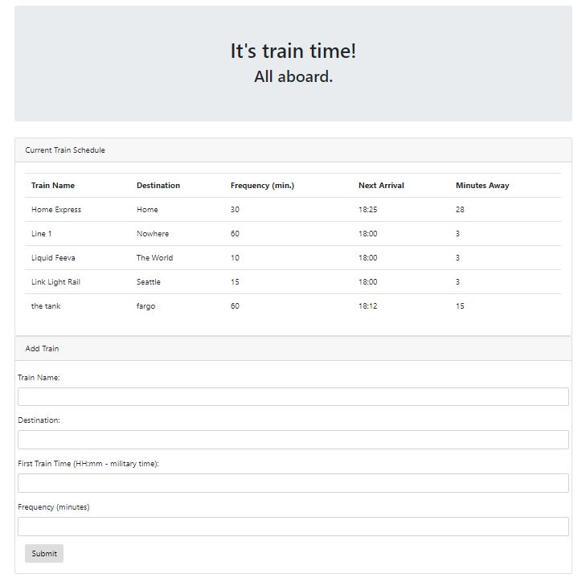

# TrainScheduler
A train scheduling application that incorporates Firebase to host arrival and departure data. The app calculates a train's next arrival time based on initial information provided by the user. 

To use the app, simply enter the train's name, destination, first train time, and frequency in the indicated fields then click "Submit". 

[Link to deployed app.](https://rutterer.github.io/TrainScheduler/)

